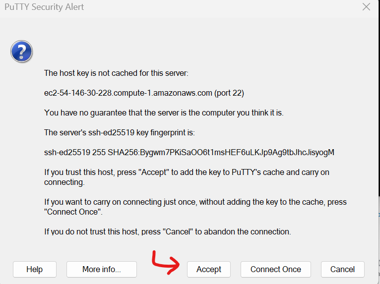

# Ponderada de Programação

### Módulo 05 - semana 03.

## Introdução

A Amazon Web Services (AWS) é uma das principais provedoras de serviços em nuvem, oferecendo serviços como o Amazon Elastic Compute Cloud (EC2), que permite a criação e gerenciamento de instâncias de máquinas virtuais escaláveis. Este relatório descreve o processo de criação de uma instância EC2 na AWS e o acesso a essa máquina virtual por meio do PuTTY e SSH.

## Objetivo

O objetivo deste relatório é fornecer um guia passo a passo para a criação de uma instância EC2 na AWS e demonstrar como acessá-la remotamente utilizando o PuTTY e SSH. 

## Materiais

•	Conta na AWS Academy;
•	Acesso à internet;
•	Um computador local com o PuTTY instalado;
•	Chave de acesso SSH (pública/privada).

## Método

### 1. Criar intância EC2

#### 1.1 Ativar o Learner Lab

Dentro da [AWS Academy](https://awsacademy.instructure.com/),   iniciar o "Learner Lab".

  Figura 1: Learner Lab
  
  Fonte: O autor (2024)

#### 1.2 Dentro de "EC2", executar uma instância

  Figura 2: Criar uma instância
  
  Fonte: O autor (2024)

#### 1.3 Definir o nome do servidor

(no exemplo foi usado "seervidor-ponderada-kaiane")

  Figura 3: Definir nome da instância
  
  Fonte: O autor (2024)

#### 1.4 Escolher uma imagem de máquina virtual (AMI), tipo de instância, configurações de rede e outras opções conforme necessidade.

  Figura 4: Definir imagem da instância
  
  Fonte: O autor (2024)

#### 1.5 Definir tipos e chaves.

Qual o porte necessário para a sua instância criada? 

Defina um par de chaves de acesso (ou use o *defalt*)

(ao configurar uma nova chave, ela é baixada na sua máquina local) --- será usada depois!

  Figura 5: Tipo de instância e Par de chaves
  
  Fonte: O autor (2024)

#### 1.6 Finalizar

  Figura 8: Executar
  
  Fonte: O autor (2024)

#### 1.7 Conferir êxito ao criar uma instância :)

  Figura 9: Êxito ao criar uma instância EC2
  
  Fonte: O autor (2024)

#### 1.8 Verificar informações sobre a sua instância.

Informações importantes sobre a sua máquina como a chave pública estão aqui.

  Figura 10: Verificar informações
  
  Fonte: O autor (2024)

### 2. Conectar á instância por meio do PuTTY 

#### 2.1 Inserir nome de usuário e DNS IPv4 público

  Figura 11: Conectar á instância por meio do PuTTY
  
  Fonte: O autor (2024)

#### 2.2 Escolher o arquivo .ppk de chave privada

  Figura 12: Credenciamento com a chave
  
  Fonte: O autor (2024)

#### 2.3 Confiar na conexão

  Figura 13: "Accept"
  
  Fonte: O autor (2024)

#### 2.4 FIM!  

  Figura 14: Conectado com sucesso
  
  Fonte: O autor (2024)

## Resultados

Após seguir o método descrito acima, foi possível criar com sucesso uma instância EC2 na AWS e acessá-la remotamente utilizando o PuTTY e SSH. A conexão foi estabelecida com êxito, permitindo a interação com a máquina virtual de forma remota.

## Conclusão

A criação de uma instância EC2 na AWS e o acesso a ela por meio do PuTTY e SSH são processos fundamentais para aproveitar os benefícios da computação em nuvem de forma eficiente e segura. Essa abordagem oferece flexibilidade, escalabilidade e facilidade de gerenciamento de recursos computacionais, contribuindo para a otimização de operações e desenvolvimento de projetos em diversos contextos.
