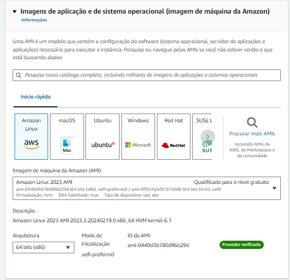

# Ponderada de Programação

### Módulo 05 - semana 03.

Crie uma instância de máquina EC2 na AWS e acesse esta máquina com SSH (sugestão de uso da ferramenta PUTTY). Registre seu trabalho em um relatório técnico em arquivo Markdown no GitHub com captura de tela do console com a máquina criada na conta de seu usuário, captura de tela do acesso SSH bem-sucedido e IP da máquina EC2 criada. Crie a documentação usando commits diferentes no GitHub, de preferência usando a interface de linha de comando. Seu relatório técnico deve conter as seções de Introdução, Objetivo, Materiais, Método, Resultados e Conclusão. Envie o link do repositório GitHub criado na sua conta Inteli no GitHub. Este repositório deve ter pelo menos 3 commits diferentes.

## Introdução

## Objetivo

## Materiais

## Método

1. 

  Figura 1: Learner Lab
  
  Fonte: O autor (2024)

  Figura 2: Criar uma instância
  
  Fonte: O autor (2024)

  Figura 3: Definir nome da instância
  
  Fonte: O autor (2024)

  Figura 4: Definir imagem da instância
  
  Fonte: O autor (2024)

  Figura 5: Tipo de instância e Par de chaves
  
  Fonte: O autor (2024)

  Figura 6: Configurações de rede
  
  Fonte: O autor (2024)

  Figura 7: Configurações de armazenamento
  
  Fonte: O autor (2024)

  Figura 8: Executar
  
  Fonte: O autor (2024)

  Figura 9: Êxito ao criar uma instância EC2
  
  Fonte: O autor (2024)

  Figura 10: Verificar informações
  
  Fonte: O autor (2024)

2. 

  Figura 11: Conectar á instância por meio do PuTTY
  
  Fonte: O autor (2024)

  Figura 12: Credenciamento com a chave
  
  Fonte: O autor (2024)

  Figura 13: "Accept"
  
  Fonte: O autor (2024)

  Figura 14: Conectado com sucesso
  
  Fonte: O autor (2024)

## Resultados

## Conclusão